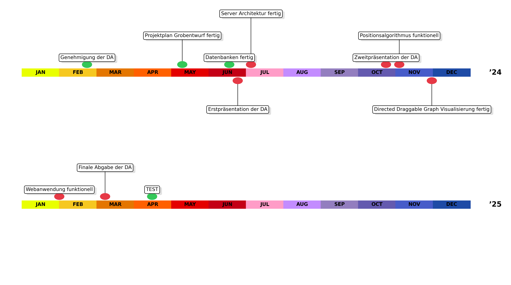

# 🗓️ TimeLineCreator – GitHub Action



Dieses Projekt rendert aus einer simplen **CSV-Datei** automatisch einen
mehrjährigen Meilenstein-Zeitstrahl (PNG).  
Die Generierung läuft als GitHub Action und aktualisiert das Bild bei jeder
Änderung an der CSV.

---

## 🚀 In 5 Minuten zum eigenen Timeline-Repo

1. **Vorlage klonen**

   ```sh
   git clone https://github.com/AndreRathlos/TimeLineCreator.git
   cd TimeLineCreator
   ```

2. **Neues (leeres) GitHub-Repo zuweisen & hochladen**

   ```sh
   git remote set-url origin https://github.com/<dein-User>/MyTimeline.git
   git push -u origin main   # erster Push
   ```

3. **Workflow-Rechte aktivieren**

   GitHub-Repo → **Settings → Actions → General** →  
   Abschnitt **Workflow permissions** → ⚙️ **Read and write** auswählen.

4. **Meilensteine pflegen**

   ```sh
   # Datei bearbeiten
   nano data/milestones.csv          # oder beliebiger Editor

   # Änderungen einchecken
   git add data/milestones.csv
   git commit -m "Milestones aktualisiert"
   git push
   ```

   Beim Push startet der Workflow **Build timeline PNG**  
   und committed das aktualisierte `docs/timeline.png` automatisch zurück.

---

## 📝 CSV-Format

| Spalte        | Beschreibung                                  | Beispiel                    |
|---------------|-----------------------------------------------|-----------------------------|
| `date`        | Datum `YYYY-MM-DD`                            | `2024-06-24`                |
| `description` | Text, der in der Box angezeigt wird           | `Erstpräsentation der DA`   |
| `status`      | `done`, `erledigt`, `yes`, `true`, `x`, `1` → ✅ | `done` / *(leer)*           |

```csv
date,description,status
2024-02-23,Genehmigung der DA,done
2024-06-24,Erstpräsentation der DA,
2025-03-07,Finale Abgabe der DA,done
```

---

## 📂 Projektstruktur

| Pfad | Zweck |
|------|-------|
| `.github/workflows/generate_timeline.yml` | GitHub Action – rendert PNG & committed es |
| `scripts/generate_timeline.py`           | Python-Renderer (benötigt nur matplotlib) |
| `data/milestones.csv`                    | **Hier** trägst du deine Meilensteine ein |
| `docs/timeline.png`                      | Ergebnisbild (wird automatisch überschrieben) |

---

## ⚙️ Häufige Anpassungen

| Wunsch | Stelle |
|--------|--------|
| Farben ändern | Liste `MONTH_C` in `generate_timeline.py` |
| Bildgröße | Parameter `figsize=( … )` im Script |
| Private Repos | Action funktioniert identisch – nur **Workflow permissions** nicht vergessen |

---

## 🛠️ Lokaler Test (optional)

```sh
pip install matplotlib
python scripts/generate_timeline.py data/milestones.csv docs/timeline.png
# Bild öffnen, z. B.:
open docs/timeline.png     # macOS / Linux
start docs/timeline.png    # Windows
```

---

Viel Erfolg beim Automatisieren deines Projekt-Zeitplans 🚀
